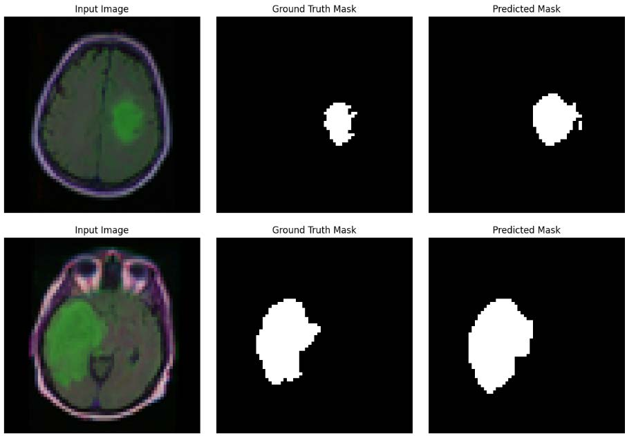

# Brain Tumor Region Segmentation  
In this project, three deep learning models U-Net, VAE, and YOLO were applied to analyze MRI image data. The U-Net model was used for brain tumor region segmentation. The VAE was employed for compressing and reconstructing MRI images, as well as extracting latent features. The YOLO model was trained to detect and localize abnormal regions or lesions in the images. The results demonstrate that each model performs effectively in its designated task and proves useful in medical image analysis.

  

